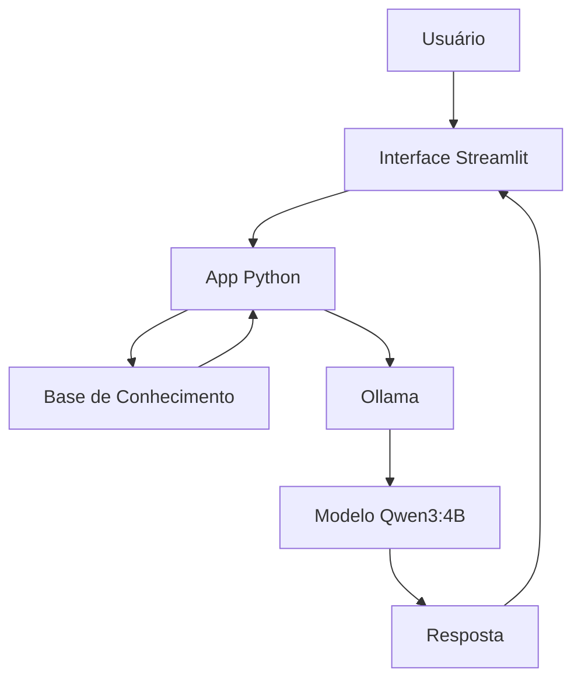

# ₿ Satoshi AI

Agente educacional especializado em Bitcoin, Blockchain, Criptografia, SHA-256, Proof of Work e Filosofia Cypherpunk.

O projeto utiliza um modelo LLM executado localmente através do Ollama e uma interface desenvolvida em Streamlit para fornecer respostas técnicas e educacionais baseadas em uma base de conhecimento composta pelo Bitcoin Whitepaper e datasets especializados.

---

## Objetivo

O objetivo do Satoshi AI é facilitar o aprendizado sobre Bitcoin e tecnologias relacionadas, oferecendo respostas contextualizadas, objetivas e alinhadas aos princípios técnicos descritos no Bitcoin Whitepaper.

O agente não realiza aconselhamento financeiro e não fornece recomendações de investimento.

---

## Principais Funcionalidades

* Explicação de conceitos fundamentais do Bitcoin
* Ensino sobre Blockchain e Proof of Work
* Explicação do algoritmo SHA-256
* Conceitos de criptografia aplicada ao Bitcoin
* Filosofia Cypherpunk e descentralização
* Respostas adaptadas ao nível técnico do usuário
* Reconhecimento de perguntas fora do escopo
* Redução de alucinações através de base de conhecimento local

---

## Tecnologias Utilizadas

| Categoria      | Tecnologia         |
| -------------- | ------------------ |
| Interface      | Streamlit          |
| Modelo LLM     | Qwen3:4B           |
| Execução Local | Ollama             |
| Linguagem      | Python             |
| Dados          | JSON e TXT         |
| Base Técnica   | Bitcoin Whitepaper |

---

## Arquitetura



---

## Base de Conhecimento

O agente utiliza uma base local composta por:

| Arquivo                    | Descrição                               |
| -------------------------- | --------------------------------------- |
| bitcoin_whitepaper.txt     | Documento técnico original do Bitcoin   |
| bitcoin_knowledge.json     | Conceitos fundamentais sobre Bitcoin    |
| cryptography_advanced.json | Criptografia e SHA-256                  |
| cypherpunk_knowledge.json  | Filosofia Cypherpunk e descentralização |

Esses dados são carregados pela aplicação e utilizados para construir o contexto enviado ao modelo.

---

## Estrutura do Projeto

```text
project/
│
├── data/
│   ├── raw/
│   ├── processed/
│   └── knowledge_base/
│
├── docs/
│   ├── 01-documentacao-agente.md
│   ├── 02-base-conhecimento.md
│   ├── 03-prompts.md
│   ├── 04-metricas.md
│   └── 05-pitch.md
│
├── src/
│   └── app.py
│
├── assets/
│
└── README.md
```

---

## Como Executar

### 1. Instalar o Ollama

```bash
ollama pull qwen3:4b
```

### 2. Instalar Dependências

```bash
pip install streamlit pandas requests
```

### 3. Executar o Ollama

```bash
ollama serve
```

### 4. Iniciar o Projeto

```bash
streamlit run src/app.py
```

---

## Limitações

O agente:

* Não fornece aconselhamento financeiro
* Não recomenda investimentos
* Não realiza previsões de mercado
* Não possui acesso à internet
* Não afirma ser o verdadeiro Satoshi Nakamoto

---

## Avaliação

O agente foi validado através de testes comparativos com:

* ChatGPT
* Gemini
* Copilot
* Grok

As métricas avaliadas incluíram:

* Assertividade
* Segurança
* Coerência
* Respeito ao escopo definido

Os resultados completos estão disponíveis em:

```text
docs/04-metricas.md
```

---

## Autor

Paulo Lunardi

Projeto acadêmico desenvolvido para estudo de IA Generativa, Engenharia de Prompt, LLMs Locais e Educação sobre Bitcoin.

### Link do Vídeo

> https://drive.google.com/file/d/1knLmLvuR26776-dCHWIujS6qHzrOAChA/view?usp=drive_link

### Link da apresentação
> https://gamma.app/docs/Satoshi-AI-mpmv1y5cz2i0hlj
---

## Ferramentas Utilizadas

### ChatGPT
https://chatgpt.com/

Utilizado para apoio na engenharia de prompts, revisão técnica da documentação, validação de conceitos sobre Bitcoin, blockchain e criptografia, além de suporte no desenvolvimento da aplicação.

### Microsoft Copilot
https://copilot.microsoft.com/

Utilizado para comparação de respostas durante os testes de avaliação do agente e validação dos critérios de assertividade e coerência.

### Google Gemini
https://gemini.google.com/

Utilizado para comparação de respostas durante os testes de avaliação e análise do comportamento de diferentes modelos de IA.

### Grok
https://grok.com/

Utilizado para comparação de respostas e validação dos testes de comportamento definidos para o agente Satoshi AI.
---

### Ollama
https://ollama.com/

Responsável pela execução local do modelo de linguagem utilizado pelo agente Satoshi AI, garantindo privacidade dos dados e independência de serviços externos.
---

### Qwen3:4B
https://ollama.com/library/qwen3

Modelo de linguagem executado localmente via Ollama. Utilizado para responder perguntas relacionadas a Bitcoin, blockchain, criptografia, SHA-256 e filosofia cypherpunk.
---

### Streamlit
https://streamlit.io/

Framework utilizado para construção da interface web do agente Satoshi AI, permitindo interação em formato de chat entre usuário e modelo.
---

## Python
https://www.python.org/

Linguagem principal utilizada para desenvolvimento da aplicação, processamento da base de conhecimento, integração com o modelo de IA e implementação das regras do agente.
---

## Pandas
https://pandas.pydata.org/

Biblioteca utilizada para manipulação, organização e processamento de dados durante a construção e preparação da base de conhecimento.
---

## Requests
https://requests.readthedocs.io/

Biblioteca utilizada para comunicação entre a aplicação Streamlit e a API local do Ollama.
---

## Hugging Face
https://huggingface.co/

Fonte de datasets utilizados na construção da base de conhecimento relacionada a Bitcoin, criptografia, SHA-256 e conceitos técnicos complementares.
---

## Bitcoin Whitepaper
https://bitcoin.org/bitcoin.pdf

Fonte primária de conhecimento utilizada pelo agente para fundamentar respostas técnicas relacionadas ao protocolo Bitcoin.
---

## NotebookLM
https://notebooklm.google.com/

Ferramenta utilizada para estudo, organização e análise de conteúdos relacionados a Bitcoin, blockchain, criptografia e filosofia cypherpunk durante a construção da base de conhecimento.
---

## Google Colab
https://colab.research.google.com/

Utilizado para experimentação, limpeza de dados, testes de código Python e preparação dos datasets utilizados pelo projeto.
---

## Git
https://git-scm.com/

Sistema de controle de versão utilizado para gerenciamento do código-fonte e histórico de alterações do projeto.
---

## GitHub
https://github.com/

Plataforma utilizada para armazenamento do repositório, versionamento do projeto e documentação da solução.
---

## Mermaid
https://mermaid.js.org/

Ferramenta utilizada para criação dos diagramas presentes na documentação da arquitetura do agente.
---

## Gamma App
https://gamma.app/

Utilizado como apoio na construção de apresentações e materiais visuais relacionados ao projeto.
---

## Loom
https://www.loom.com/

Ferramenta utilizada para gravação das demonstrações e do pitch do projeto.
---

## Clipchamp
https://clipchamp.com/

Utilizado para edição e consolidação dos vídeos gravados durante a apresentação da solução.
---

## Cloud Clusters
https://clients.cloudclusters.io/

Plataforma de computação em nuvem utilizada em estudos relacionados a banco de dados, hospedagem de aplicações e experimentação de ambientes de desenvolvimento.
---

## MariaDB
https://mariadb.org/

Sistema gerenciador de banco de dados utilizado em projetos de estudo voltados para modelagem, consultas SQL e armazenamento de informações.
---

## phpMyAdmin
https://www.phpmyadmin.net/

Ferramenta utilizada para administração de bancos MariaDB, criação de tabelas, execução de consultas SQL e gerenciamento da estrutura dos dados.
---


---

## LinkedIn
https://www.linkedin.com/in/paulo-lunardi-b82516b2/

Utilizado para compartilhamento da evolução do projeto, networking profissional e divulgação de conteúdos relacionados à tecnologia, blockchain, SAP e ciência de dados.
