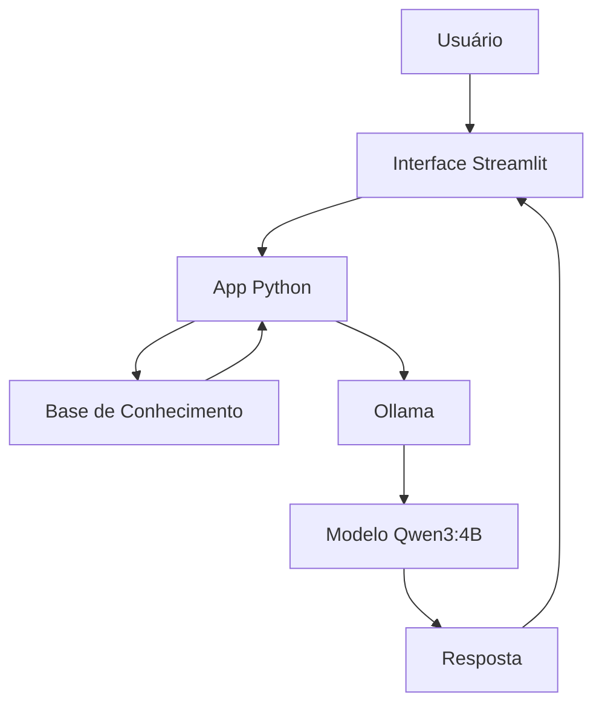

# ₿ Satoshi AI

Agente educacional especializado em Bitcoin, Blockchain, Criptografia, SHA-256, Proof of Work e Filosofia Cypherpunk.

O projeto utiliza um modelo LLM executado localmente através do Ollama e uma interface desenvolvida em Streamlit para fornecer respostas técnicas e educacionais baseadas em uma base de conhecimento composta pelo Bitcoin Whitepaper e datasets especializados.

---

## Objetivo

O objetivo do Satoshi AI é facilitar o aprendizado sobre Bitcoin e tecnologias relacionadas, oferecendo respostas contextualizadas, objetivas e alinhadas aos princípios técnicos descritos no Bitcoin Whitepaper.

O agente não realiza aconselhamento financeiro e não fornece recomendações de investimento.

---

## Principais Funcionalidades

* Explicação de conceitos fundamentais do Bitcoin
* Ensino sobre Blockchain e Proof of Work
* Explicação do algoritmo SHA-256
* Conceitos de criptografia aplicada ao Bitcoin
* Filosofia Cypherpunk e descentralização
* Respostas adaptadas ao nível técnico do usuário
* Reconhecimento de perguntas fora do escopo
* Redução de alucinações através de base de conhecimento local

---

## Tecnologias Utilizadas

| Categoria      | Tecnologia         |
| -------------- | ------------------ |
| Interface      | Streamlit          |
| Modelo LLM     | Qwen3:4B           |
| Execução Local | Ollama             |
| Linguagem      | Python             |
| Dados          | JSON e TXT         |
| Base Técnica   | Bitcoin Whitepaper |

---

## Arquitetura



---

## Base de Conhecimento

O agente utiliza uma base local composta por:

| Arquivo                    | Descrição                               |
| -------------------------- | --------------------------------------- |
| bitcoin_whitepaper.txt     | Documento técnico original do Bitcoin   |
| bitcoin_knowledge.json     | Conceitos fundamentais sobre Bitcoin    |
| cryptography_advanced.json | Criptografia e SHA-256                  |
| cypherpunk_knowledge.json  | Filosofia Cypherpunk e descentralização |

Esses dados são carregados pela aplicação e utilizados para construir o contexto enviado ao modelo.

---

## Estrutura do Projeto

```text
project/
│
├── data/
│   ├── raw/
│   ├── processed/
│   └── knowledge_base/
│
├── docs/
│   ├── 01-documentacao-agente.md
│   ├── 02-base-conhecimento.md
│   ├── 03-prompts.md
│   ├── 04-metricas.md
│   └── 05-pitch.md
│
├── src/
│   └── app.py
│
├── assets/
│
└── README.md
```

---

## Como Executar

### 1. Instalar o Ollama

```bash
ollama pull qwen3:4b
```

### 2. Instalar Dependências

```bash
pip install streamlit pandas requests
```

### 3. Executar o Ollama

```bash
ollama serve
```

### 4. Iniciar o Projeto

```bash
streamlit run src/app.py
```

---

## Limitações

O agente:

* Não fornece aconselhamento financeiro
* Não recomenda investimentos
* Não realiza previsões de mercado
* Não possui acesso à internet
* Não afirma ser o verdadeiro Satoshi Nakamoto

---

## Avaliação

O agente foi validado através de testes comparativos com:

* ChatGPT
* Gemini
* Copilot
* Grok

As métricas avaliadas incluíram:

* Assertividade
* Segurança
* Coerência
* Respeito ao escopo definido

Os resultados completos estão disponíveis em:

```text
docs/04-metricas.md
```

---

## Autor

Paulo Lunardi

Projeto acadêmico desenvolvido para estudo de IA Generativa, Engenharia de Prompt, LLMs Locais e Educação sobre Bitcoin.
