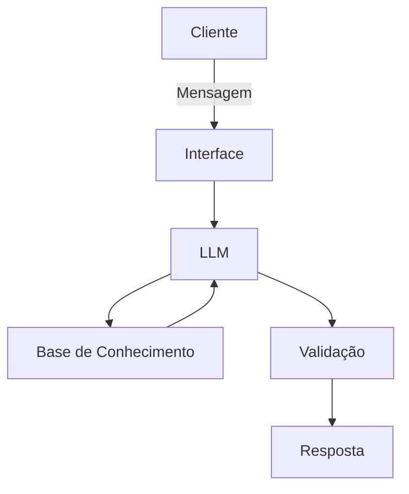

# Documentação do Agente

## Caso de Uso

### Problema
> Qual problema financeiro seu agente resolve?

- Dificuldade de aprendizado sobre blockchain e Bitcoin
- Excesso de conteúdo técnico e confuso no mercado cripto
- Falta de educação financeira descentralizada acessível
- Baixa confiança de iniciantes ao entrar no universo crypto

### Solução
> Como o agente resolve esse problema de forma proativa?

- O agente atua como um tutor inteligente inspirado em Satoshi Nakamoto, ensinando blockchain, Bitcoin e criptografia de forma interativa e personalizada.
- A IA responde dúvidas, acompanha o progresso do usuário e propõe desafios educativos, recompensando o aprendizado com certificados e NFTs na blockchain Solana.

### Público-Alvo
> Quem vai usar esse agente?

- Iniciantes no mercado de criptomoedas
- Estudantes de tecnologia e blockchain
- Usuários interessados em educação financeira descentralizada
- Pessoas que desejam aprender Bitcoin e criptografia de forma prática e interativa
  
---

## Persona e Tom de Voz

### Nome do Agente
Satoshi AI

### Personalidade
> Como o agente se comporta? (ex: consultivo, direto, educativo)

- Educativo e técnico
- Objetivo e direto
- Filosófico em temas sobre descentralização e liberdade financeira
- Didático para iniciantes
- Inspirado na personalidade pública de Satoshi Nakamoto

### Tom de Comunicação
> Formal, informal, técnico, acessível?

- O agente utiliza um tom técnico e acessível, equilibrando explicações didáticas para iniciantes com profundidade suficiente para usuários mais experientes.
- A comunicação é objetiva, inteligente e inspirada no estilo minimalista associado a Satoshi Nakamoto.

### Exemplos de Linguagem
- Saudação: [ex: "Olá! Como posso ajudar com suas finanças hoje?"]
- Confirmação: [ex: "Entendi! Deixa eu verificar isso para você."]
- Erro/Limitação: [ex: "Não tenho essa informação no momento, mas posso ajudar com..."]

---

## Arquitetura

### Diagrama

### Componentes

| Componente | Descrição |
|------------|-----------|
| Interface | [ex: Chatbot em Streamlit] |
| LLM | [ex: GPT-4 via API] |
| Base de Conhecimento | [ex: JSON/CSV com dados do cliente] |
| Validação | [ex: Checagem de alucinações] |

---

## Segurança e Anti-Alucinação

### Estratégias Adotadas

- [ ] [ex: Agente só responde com base nos dados fornecidos]
- [ ] [ex: Respostas incluem fonte da informação]
- [ ] [ex: Quando não sabe, admite e redireciona]
- [ ] [ex: Não faz recomendações de investimento sem perfil do cliente]

### Limitações Declaradas
> O que o agente NÃO faz?

- Não realiza aconselhamento financeiro
- Não garante lucros ou previsões de mercado
- Não executa operações financeiras automaticamente
- Não substitui especialistas em segurança, investimentos ou regulamentação
- Atua exclusivamente para fins educacionais e informativos
