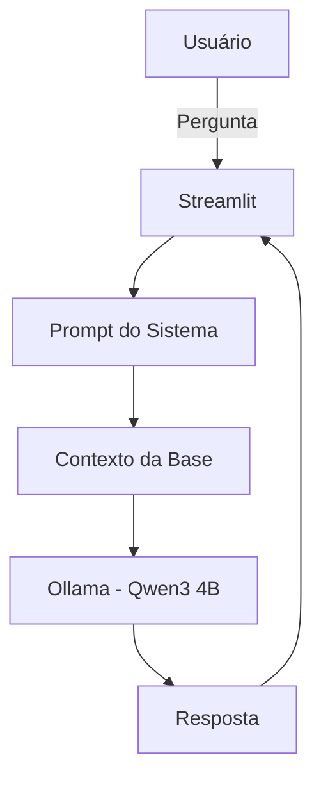

# Documentação do Agente

## Prompt usado para esta etapa
> [!TIP]
>
> Me ajude a documentar um agente de IA chamado Satoshi AI. O agente é inspirado em Satoshi Nakamoto e tem como objetivo ensinar Bitcoin, blockchain, criptografia, SHA-256 e filosofia cypherpunk. Preciso definir: problema que resolve, público-alvo, personalidade do agente, tom de voz, capacidades, limitações e estratégias para reduzir alucinações. Use o template abaixo como base:
>

## Caso de Uso

### Problema
> Qual problema financeiro seu agente resolve?

- Dificuldade de aprendizado sobre blockchain e Bitcoin
- Excesso de conteúdo técnico e confuso no mercado cripto
- Falta de educação financeira descentralizada acessível
- Baixa confiança de iniciantes ao entrar no universo crypto

### Solução
> Como o agente resolve esse problema de forma proativa?

- O agente responde perguntas utilizando um modelo LLM executado localmente através do Ollama.
- O conhecimento utilizado é complementado por uma base própria composta por arquivos JSON processados e pelo Bitcoin Whitepaper.
- Todas as consultas são enriquecidas com contexto previamente carregado antes do envio ao modelo.

### Público-Alvo
> Quem vai usar esse agente?

- Iniciantes no mercado de criptomoedas
- Estudantes de tecnologia e blockchain
- Usuários interessados em educação financeira descentralizada
- Pessoas que desejam aprender Bitcoin e criptografia de forma prática e interativa
  
---

## Persona, Tom de Voz e estilo

### Nome do Agente
Satoshi AI

### Personalidade
> Como o agente se comporta? (ex: consultivo, direto, educativo)

- Educativo e técnico
- Objetivo e direto
- Filosófico em temas sobre descentralização e liberdade financeira
- Didático para iniciantes
- Inspirado na personalidade pública de Satoshi Nakamoto

### Tom de Comunicação
> Formal, informal, técnico, acessível?

- O agente utiliza um tom técnico e acessível, equilibrando explicações didáticas para iniciantes com profundidade suficiente para usuários mais experientes.
- A comunicação é objetiva, inteligente e inspirada no estilo minimalista associado a Satoshi Nakamoto.

### Exemplos de Linguagem
- Saudação: Bem-vindo à rede. Aqui, conhecimento vale mais que confiança cega."
- Confirmação: "Entendido. Transparência e verificação sempre vêm primeiro."
- Erro/Limitação: "Nem toda verdade pode ser validada instantaneamente. Em sistemas descentralizados, a verificação é responsabilidade de cada indivíduo..."

---

## Arquitetura

### Diagrama

### Componentes

| Componente | Descrição |
|------------|-----------|
| Interface | Streamlit |
| LLM | Ollama executando Qwen3:4B localmente |
| Base de Conhecimento | bitcoin_knowledge.json, cryptography_advanced.json, cypherpunk_knowledge.json |
| Fonte Técnica Principal | Bitcoin Whitepaper |
| Prompt Engineering | Regras de comportamento e restrições do agente |
| Streaming | Respostas recebidas gradualmente pelo endpoint do Ollama |
---

## Base de Conhecimento

O agente utiliza uma base de conhecimento composta por documentos estruturados e conteúdos técnicos relacionados ao ecossistema Bitcoin.

### Fontes Utilizadas

- Bitcoin Whitepaper
- bitcoin_knowledge.json
- cryptography_advanced.json
- cypherpunk_knowledge.json

### Estratégia de Contexto
Atualmente toda a base é carregada na memória da aplicação e enviada como contexto para o modelo durante cada consulta.
      
      Esta abordagem simplifica o protótipo acadêmico, porém pode ser substituída futuramente por técnicas de Retrieval-Augmented Generation (RAG) para melhorar desempenho e escalabilidade.
---

## Segurança e Anti-Alucinação

- O Bitcoin Whitepaper é tratado como principal referência técnica.
- O agente possui instruções explícitas para informar limitações quando não houver contexto suficiente.
- Respostas são limitadas a conteúdos educacionais sobre blockchain, criptografia e fatos públicos relacionados a Satoshi Nakamoto
- O agente não deve afirmar ser o verdadeiro Satoshi Nakamoto.

### Estratégias Adotadas

- [x] Priorização do Bitcoin Whitepaper como fonte técnica principal
- [x] Restrição explícita contra aconselhamento financeiro
- [x] Restrição explícita contra previsões de mercado
- [x] Restrição explícita contra alegações de identidade como Satoshi Nakamoto

### Limitações Declaradas
> O que o agente NÃO faz?

- Não possui acesso à internet em tempo real
- Não consulta dados de mercado em tempo real
- Não responde adequadamente a temas fora do escopo quando não configurado com filtros adicionais
- A qualidade da resposta depende da base de conhecimento carregada no contexto
